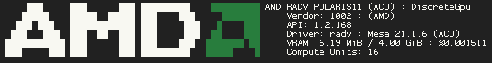
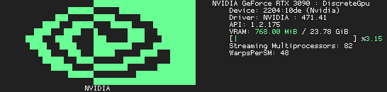
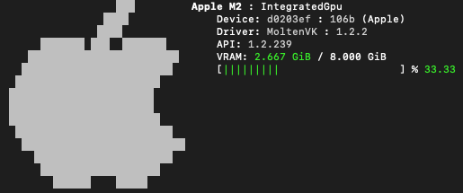

# vkfetch [](LICENSE) [](https://github.com/Wunkolo/vkfetch/actions/workflows/cmake.yml)

`vkfetch` is a fetch-program that displays basic information about your vulkan-compatible graphic card(s)!

`vkfetch` will also display some vendor-specific information about your GPU, when available.







# Building

`vkfetch` will require the vulkan SDK headers for your platform to build. Check out [lunarg](https://vulkan.lunarg.com/) to get started or use your linux distro's package manager!

This is a CMake project, so a typical [Cmake out-of-source build procedure](http://preshing.com/20170511/how-to-build-a-cmake-based-project/#running-cmake-from-the-command-line) will get you going on both Windows and Linux:

```
git clone git@github.com:Wunkolo/vkfetch.git
cd vkfetch
mkdir build
cd build
cmake ..
cmake --build .
./vkfetch
```
